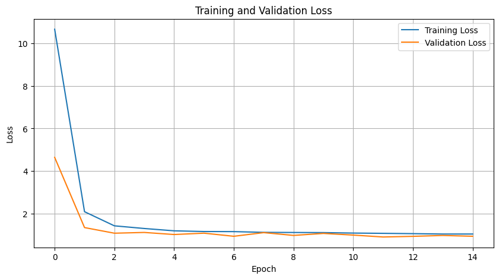
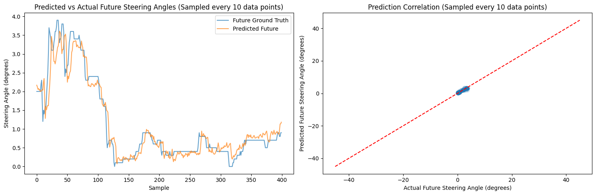
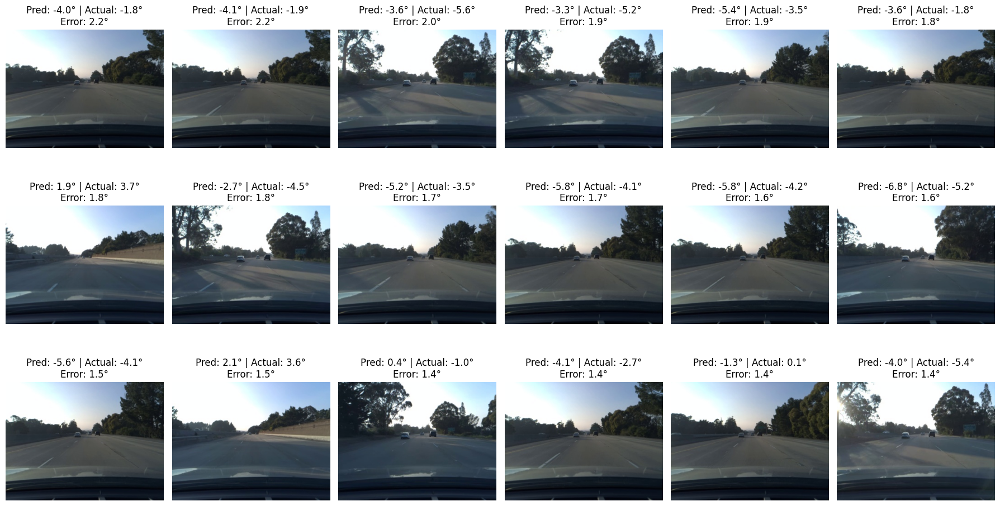
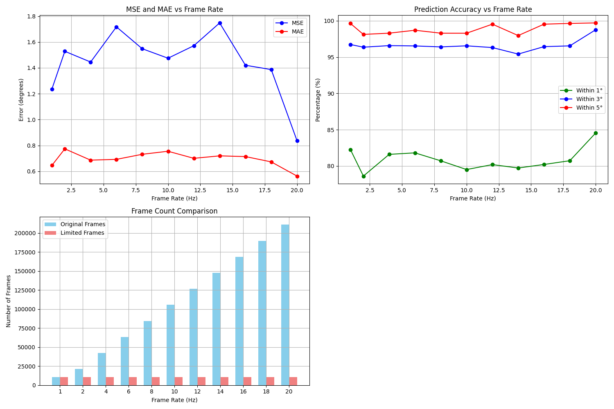
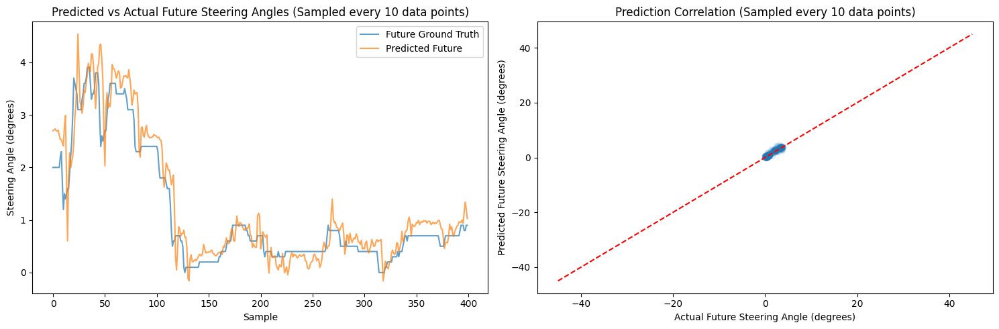
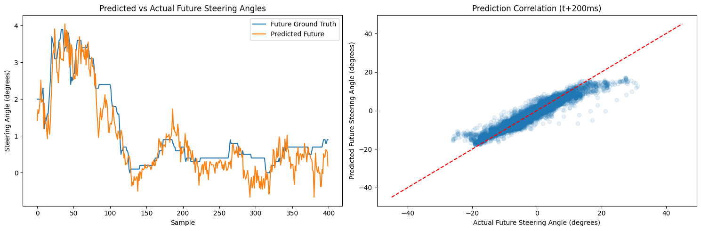
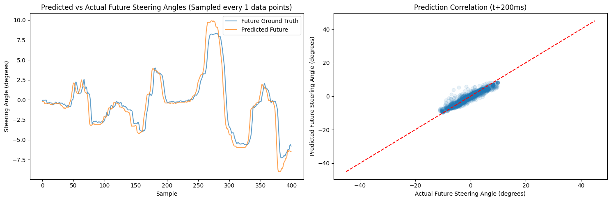
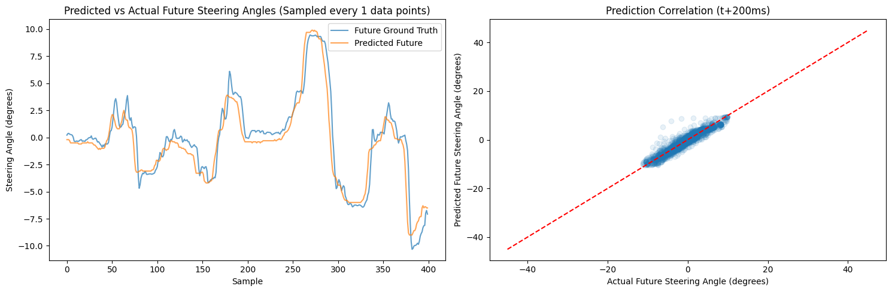

# SteerNet

This project evaluates four architectures for short-term steering prediction: a baseline CNN inspired by NVIDIA’s PilotNet, an enhanced CNN with more temporal steering history, a MobileNetV2-based CNN, and an RNN with ConvLSTM. All models performed similarly, with RNN demonstrating the highest accuracy (MAE 0.57°).

> [!CAUTION] 
> The report is written based on the result of the [previous version](https://github.com/gh0stintheshe11/SteerNet/tree/52d8f3934dbdb8a67bdfaafc7b5af43fbc6916fe) of the project. Some of the latest results does not match exactly with the results in the report. However, the overall conclusions remain the same. 

## Table of Contents

- [SteerNet](#steernet)
  - [Table of Contents](#table-of-contents)
  - [Project Sturcture](#project-sturcture)
  - [Project Setup](#project-setup)
    - [Downlaod the Dataset](#downlaod-the-dataset)
    - [Install Dependencies](#install-dependencies)
    - [Data Preparation](#data-preparation)
    - [Model Building/Training/Evaluation](#model-buildingtrainingevaluation)
  - [Latest Results](#latest-results)

## Project Sturcture

```bash
SteerNet/
├── ECE1508_Project_Report.pdf # report for this project
├── data/ # original dataset
├── data_synced/ # dataset after syncing the sensor data with video frames
├── model_checkpoints/ # all model trained in this project will be saved here as .pth files
├── deprecated/ # deprecated files
├── aria2c.exe # aria2c executable used for downloading the dataset on windows
├── download_dataset.py # dataset download script
├── data_prep_v2.py # data preparation script
├── requirements.txt # all dependencies for this project
├── README.md # this file
├── v4_CNN_framerate_test.ipynb # framerate test for v4_CNN
├── v4_CNN_MobileNetV2.ipynb
├── v4_CNN.ipynb
├── v4_CNN2.ipynb
├── v4_RNN.ipynb
├── v4_RNN_GRU.ipynb
├── results/ # all results diagrams for this project will be saved here
```

## Project Setup

### Downlaod the Dataset

- For Windows:

  1. Open a terminal/command prompt in the root folder of this project

  2. Run this command to download the full dataset (94.62GB):
  ```bash
  .\aria2c.exe --dir="data/" --seed-time=0 --continue=true "https://academictorrents.com/download/65a2fbc964078aff62076ff4e103f18b951c5ddb.torrent"
  ```

  3. To download selected chunks (about 9GB each), add `--select-file=1` (for first chunk), `--select-file=2` (for second chunk), etc.:
  ```bash
  .\aria2c.exe --dir="data/" --select-file=1 --seed-time=0 --continue=true "https://academictorrents.com/download/65a2fbc964078aff62076ff4e103f18b951c5ddb.torrent"
  ```

  4. None important part (this is just what nerds do)

  ```bash
  .\aria2c.exe --dir="E:\SteerNet\data" --select-file=2 --seed-time=0 --file-allocation=falloc --max-connection-per-server=16 --split=16 --min-split-size=1M --max-concurrent-downloads=64 --max-overall-download-limit=0 --max-download-limit=0 --disable-ipv6=true --bt-max-peers=500 --bt-request-peer-speed-limit=0 --max-overall-upload-limit=1K --async-dns=true --summary-interval=1 --disk-cache=128M --enable-mmap=true --optimize-concurrent-downloads=true --bt-tracker="http://academictorrents.com:6969/announce,udp://tracker.opentrackr.org:1337/announce,udp://9.rarbg.com:2810/announce,udp://tracker.openbittorrent.com:6969/announce,udp://tracker.torrent.eu.org:451/announce,udp://exodus.desync.com:6969/announce,udp://tracker.torrent.eu.org:451/announce,udp://tracker.moeking.me:6969/announce,udp://tracker.opentrackr.org:1337/announce,udp://open.stealth.si:80/announce,udp://movies.zsw.ca:6969/announce" --bt-enable-lpd=true --enable-peer-exchange=true --follow-torrent=mem --continue=true --console-log-level=notice "https://academictorrents.com/download/65a2fbc964078aff62076ff4e103f18b951c5ddb.torrent"
  ```

- For Mac:
  directly run the [download_dataset.py](download_dataset.py) to download the dataset

  ```bash
  python download_dataset.py
  ```

> [!WARNING] 
> Download speed will vary based on your internet connection and available seeders. Thus, it is best to download the few chunks than the full dataset.

### Install Dependencies

```bash
pip install -r requirements.txt
```

### Data Preparation

The origianl dataset is video segments and CAN bus sensor data. However, the sensor log data is not at the same rate as the video frames, ie, we have much more sensor data than video frames. Since the input of the models is the video frames and the log data, we need to sync the sensor data with the video frames.

```bash
python data_prep_v2.py
```
> [!NOTE]  
> If you want to explore the frame rate vs model accuracy experiment as we did in the report, you can change the diresred frame rate in the [data_prep_v2.py](data_prep_v2.py) script.

### Model Building/Training/Evaluation

Model building/training/evaluation is done in Jupyter Notebook files named as models' names.
In the training section, we plot the training status and loss diagrams.

- example of v4_CNN training results


In the testing section, we plot the prediction vs ground truth diagram, correlation diagram, and some most wrong predictions with thier video frames so we can investigate what is the potential cause of the wrong predictions.

- example of v4_CNN testing results

- example of wrong predictions


## Latest Results

After report is written, we did more training with larger dataset, more epochs, and more improved training process out of our curiosity. The result are basically the same as the report. 

The framerate experiment result is updated compared to the report. The new result is generate with more well designed experiment setup. The result shows that the framerate is not ralated to the model's performance. ie, using 1 fps frame rate as input and 10 fps frame rate as input will get the similar performance from the model. Even though the result changes, but this experiment still means significant due to the same reason as we inlcude in the presentation and report. 

***As trainings involves images is perticularly time consuming and computing power intensive, knowing that using fewer frames will get similar performance from model is effectivly reducing the training time and increasing the efficiency of the training process***



The RNN performance is the best but all model performan at the same level. All models are able to predict the steering angle with decent accuracy. ie, the model knows how, when, and even how much to steer. However, the model's driving style is not matching the ground truth (the human driver's style) exactly, which is not really a problem based on the accuracy shown in the result.

- CNN

- CNN version 2

- CNN MobileNetV2


> [!NOTE]  
> Due to the incased size of the dataset for the new training, it is particularly time consuming to train the RNN models due to its nature of using sequential dataset format. Thus, so far the training is not completed. The results are based on the old training on smaller dataset.

- RNN old

- RNN GRU old


Overall, the conclusion is the same as the report. Using camera video frames and sensor data as input, CNN can predict the steering angle with decent accuracy. However, due to the stateless nature of the CNN, it can only predict a steering angle for a short period of time, not predict more steps into the future, which leads many problems, such as failing to detect obstacles and turning too late. Such problems are solved by the RNN models' stateful nature. When the model is making decent predictions, RNN and CNN models can get similar performance. But when CNN is making wrong predictions due to the problem mentioned above, RNN is more likely to avoid the problem and make better predictions.